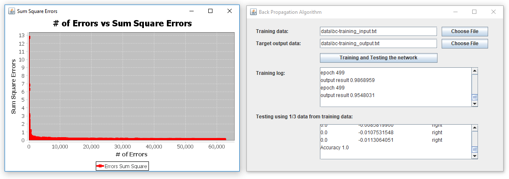

## JavaBackPropagation
Neural Network - BackPropagation implemented in Java GUI-Based
## Screenshot

## How to use?
Fork, Clone, and Download this project, then import using eclipse IDE.

## License

&copy; 2017 [Muhammad Syafrudin](https://justudin.com)

